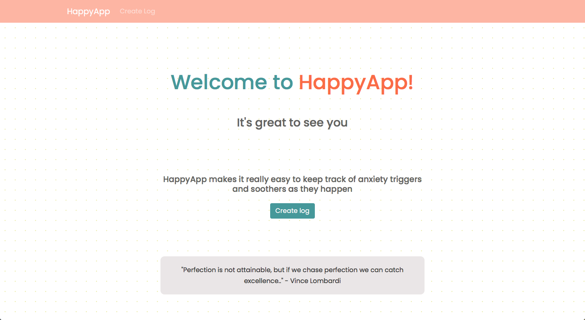

## How to run:


Install the dependencies:
```bash
npm install
```

Then start the server:
```bash
cd backend
nodemon server
```

Then launch React:
```bash
cd happy-app
npm run dev
```

App will now run at localhost:3000.
